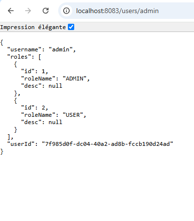

# tp2_ORM_JPA_Hib_Sp_DtP2User
tp2:ORM JPA Hibernate Spring Data
## part2 - User and Role Management System 
This Spring Boot application manages users and roles.using **Spring Data JPA**, **H2 Database (later migrated to MySQL)**, **Spring Web**, and **Lombok**.

##  Technologies Used
- Java 23
- Spring Boot
- Spring Data JPA
- H2 Database (migrated to MySQL)
- Lombok
##  Project Structure
 

##  Project Configuration
- Use **Spring Initializr** to generate a Spring Boot project with the following dependencies:
  - **Spring Web**
  - **Spring Data JPA**
  - **H2 Database**
  - **Lombok**
###  `application.properties` 
```properties
spring.application.name=UserRole
server.port=8083
spring.datasource.url=jdbc:mysql://localhost:3306/users-db?createDatabaseIfNotExist=true
spring.datasource.username=root
spring.datasource.password=
spring.jpa.hibernate.ddl-auto=create
spring.jpa.properties.hibernate.dialect=org.hibernate.dialect.MariaDBDialect
```
##  Entities 
### `User`
```java
@Entity
@Table(name="USERS")
@Data @NoArgsConstructor @AllArgsConstructor
public class User {
    @Id
    private String UserId;
    @Column(unique = true , length = 20)
    private String username;
    @JsonProperty(access = JsonProperty.Access.WRITE_ONLY)
    private  String password;
    @ManyToMany(mappedBy = "users",fetch= FetchType.EAGER)
    private List<Role> roles=new ArrayList<>();
}
```
### `Role` 
```java
@Entity
@Data @NoArgsConstructor @AllArgsConstructor

public class Role {
    @Id @GeneratedValue(strategy = GenerationType.IDENTITY)
    private Long id;
    //pour  nom unique
    @Column(unique = true , length = 20)
    private String roleName;
    @Column(name = "DESCRIPTION")
    private String desc;
    @ManyToMany(fetch = FetchType.EAGER)
    //@JoinTable(name ="USERS_ROLES" )
    @ToString.Exclude
    @JsonProperty(access = JsonProperty.Access.WRITE_ONLY)
    private List<User> users=new ArrayList<>();
}
```

## Repositories (Interfaces)
**`UserRepository`**
```java
package User.example.demo.repository;
import User.example.demo.entities.User;
import org.springframework.data.jpa.repository.JpaRepository;
public interface UserRepository extends JpaRepository<User,String> {
    User findByUsername(String username);
}
```
   - Extends `JpaRepository` to provide CRUD operations for the `User` entity.
   - **Key Methods**:
     - `findByUsername(String username)`: Find a user by their `username`.
    
**`RoleRepository`**
```java
package User.example.demo.repository;
import User.example.demo.entities.Role;
import User.example.demo.entities.User;
import org.springframework.data.jpa.repository.JpaRepository;
public interface RoleRepository extends JpaRepository<Role,Long> {
    Role findByRoleName(String roleName);
}
```
   - Extends `JpaRepository` to provide CRUD operations for the `Role` entity.
   - **Key Methods**:
     - `findByRoleName(String roleName)`: Find a role by its `roleName`.

## Services
**`UserServiceImpl`**
```java
package User.example.demo.service;

import User.example.demo.entities.Role;
import User.example.demo.entities.User;
import User.example.demo.repository.RoleRepository;
import User.example.demo.repository.UserRepository;
import jakarta.transaction.Transactional;
import lombok.AllArgsConstructor;
import org.springframework.stereotype.Service;

import java.util.UUID;

@Service
@Transactional
@AllArgsConstructor
public class UserServiceImpl implements UserService{
private RoleRepository roleRepository;
private UserRepository userRepository;
    @Override
    public User addUser(User user) {
        user.setUserId(UUID.randomUUID().toString());
        return userRepository.save(user);
    }

    @Override
    public Role addRole(Role role) {
        return roleRepository.save(role);
    }

    @Override
    public User findUserByName(String name) {
        return userRepository.findByUsername(name);
    }

    @Override
    public Role findRoleByName(String name) {
        return roleRepository.findByRoleName(name);
    }

    @Override
    public void addRoleToUser(String username, String rolename) {
User user=findUserByName(username);
Role role=findRoleByName(rolename);
if (user.getRoles()!=null){
    user.getRoles().add(role);
    role.getUsers().add(user);
}

    }

    @Override
    public User authenticate(String username, String password) {
        User user=findUserByName(username);
        if (user==null){
            throw new RuntimeException("bad credentials");

        }
        if (user.getPassword().equals(password)){
            return user;
        }
        throw new RuntimeException("bad credentials");
    }
}

```
 - **Methods**:
     - `addUser(User user)`: Adds a new user.
     - `addRole(Role role)`: Adds a new role.
     - `findUserByName(String name)`: Finds a user by `username`.
     - `findRoleByName(String name)`: Finds a role by `roleName`.
     - `addRoleToUser(String username, String rolename)`: Assigns a role to a user.
     - `authenticate(String username, String password)`: Authenticates a user by verifying their credentials.    
 ## UserController
```java
package User.example.demo.web;
import User.example.demo.service.UserService;
import User.example.demo.entities.User;
import org.springframework.beans.factory.annotation.Autowired;
import org.springframework.web.bind.annotation.GetMapping;
import org.springframework.web.bind.annotation.PathVariable;
import org.springframework.web.bind.annotation.RestController;
@RestController
public class UserController {
    @Autowired
    private UserService userService;
    @GetMapping("/users/{username}")
    public User user(@PathVariable String username) {
        User user=userService.findUserByName(username);
        return user;
        }
}

```
- A REST controller that handles HTTP requests for managing users.   
**exemple**  
  
